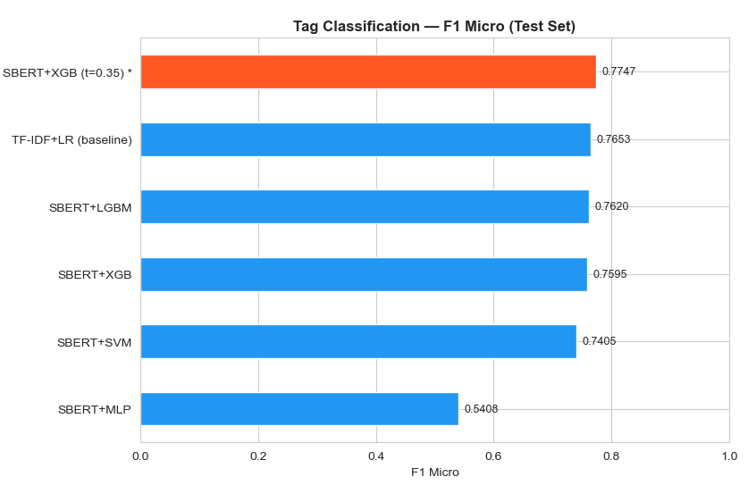
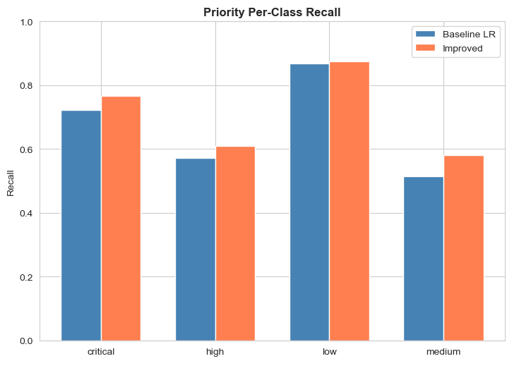
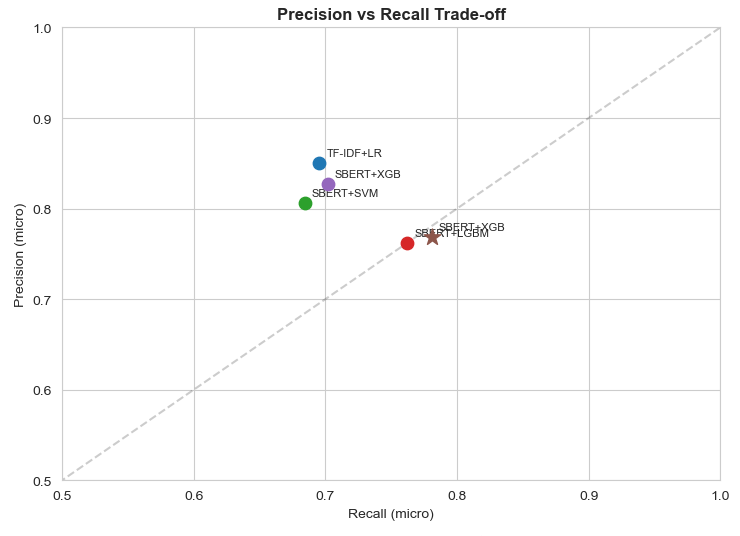
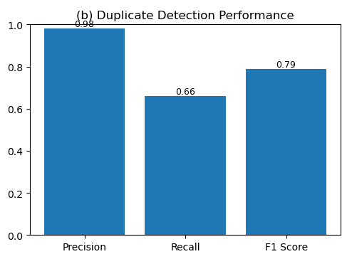
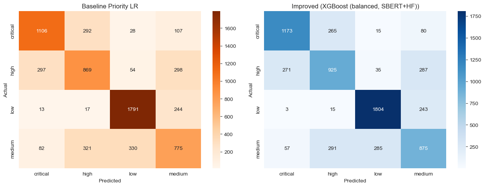

# ITARS — Intelligent Ticket Auto-Routing System

[](https://github.com/Eklavya-Singh-Rathore/ITARS/actions/workflows/ci.yml)
[](LICENSE)
[](https://www.python.org/)
[](https://nextjs.org/)

An end-to-end, **deterministic** support-ticket router with grounded AI assistance.
It ingests raw tickets and produces (a) a routing decision (department / priority /
mode), (b) a duplicate verdict, (c) a layered explanation, (d) cited AI assistance
for reviewers, and (e) a captured human-feedback loop that feeds retrieval back.

> **Status — v1.0 (Phases 1–14 complete).** 109/111 backend tests passing,
> frontend lint + build clean, prod LLM verified live against Gemini 2.5 Flash.

---

## Why this is different

- **Routing is deterministic.** LLMs assist; they never decide. The routing
  decision uses fine-tuned SBERT + XGBoost + a hybrid tag-vote/prototype
  score + a two-stage confidence gate. The same code path that the dashboard
  shows is the one that runs in production — no silent stubs.
- **Grounded, advisory AI.** AI surfaces sit *off* the routing path, cite every
  source, and **refuse to generate** (`insufficient_evidence`) when retrieval is
  below the confidence floor. No DB writes from LLM output.
- **Layered explainability on every ticket** — plain prose, agent-facing
  evidence (named gate rule, tag-vote bars, urgency cues), and an admin
  forensics layer (raw margin / entropy / per-dept scores).
- **A real feedback loop.** Human overrides are persisted *and* upserted into
  the RAG `feedback_records` collection, so retrieval improves as reviewers
  work.

---

## Architecture

```
┌─────────────────────────────────────────────────────────────────────┐
│  Next.js 16 frontend  (Zod-typed API client, status-colour palette) │
└──────────────────────────────┬──────────────────────────────────────┘
                               │ REST (JSON)
┌──────────────────────────────▼──────────────────────────────────────┐
│  FastAPI backend                                                    │
│  ┌───────────────────────────────────────────────────────────────┐  │
│  │  Routing Pipeline (deterministic — off the AI path)           │  │
│  │   Translate → Duplicate → Tags → Priority → Hybrid → Gate     │  │
│  │   → Explainability                                            │  │
│  └───────────────────────────────────────────────────────────────┘  │
│  ┌────────────────────────┐  ┌─────────────────────────────────┐    │
│  │  Persistence           │  │  RAG (retrieval-only)           │    │
│  │  SQLAlchemy 2.0        │  │  BGE-small + Qdrant             │    │
│  │  6 normalised tables   │  │  5 collections + citations      │    │
│  └────────────────────────┘  └─────────────────────────────────┘    │
│  ┌────────────────────────┐  ┌─────────────────────────────────┐    │
│  │  LLM Gateway           │  │  AI Assistant (advisory)        │    │
│  │  Echo / Gemini / Grok  │  │  Summary / Explanation /        │    │
│  │  Budget + prompt fence │  │  Recommendation / Actions       │    │
│  └────────────────────────┘  └─────────────────────────────────┘    │
└─────────────────────────────────────────────────────────────────────┘
```

### Components

| Layer | What it does | Implementation |
|---|---|---|
| **Routing Engine** | Multi-label tags + priority + hybrid department score + two-stage gate | XGBoost on fine-tuned SBERT vectors + dept prototypes |
| **Duplicate Detection** | FAISS nearest-neighbour over a duplicate-fine-tuned SBERT | `IndexFlatIP`, threshold-driven verdict |
| **Translation Layer** | langdetect + MarianMT (de, romance) with an LRU cache; original text preserved | Lazy load per language family |
| **Explainability Engine** | Three layers per ticket: plain prose / evidence / forensics | Named gate rule, matched urgency words, per-dept scores |
| **Persistence Layer** | Every decision logged; six-table schema, Postgres-ready | SQLAlchemy 2.0 + SQLite (default) |
| **Analytics & Monitoring** | Distributions + confidence histogram with gate floor + reroute rates + override flow | Recharts + a dependency-free custom SVG bipartite Sankey |
| **RAG Retrieval** | BGE-small embeddings, 5 collections, score-floor refusal | Qdrant (in-memory by default; URL/path swappable) |
| **LLM Gateway** | Provider-agnostic, fallback chain, prompt-injection fencing, budget caps | REST via `httpx` — no SDK |
| **AI Assistant Layer** | Summary / Explanation / Recommendation / Actions, cited; `insufficient_evidence` guard | Composes the gateway + RAG; advisory only |

---

## Technology Stack

### Backend
- **FastAPI 0.115** + Pydantic v2 + Uvicorn
- **SQLAlchemy 2.0** (SQLite default; Postgres via `postgresql+psycopg://…`)
- **Qdrant 1.12** (RAG only — retrieval, never routing)
- **SBERT** — `Eklavya73/sbert_finetuned` (routing) +
  `Eklavya73/duplicate_sbert` (duplicates), both fine-tuned from
  `sentence-transformers/all-mpnet-base-v2`
- **XGBoost 2.1** — multi-label tags + priority
- **FAISS 1.8** — duplicate index (`IndexFlatIP`)
- **httpx 0.27** — LLM REST without an SDK

### Frontend
- **Next.js 16** (App Router, Turbopack) + **React 19**
- **TypeScript 5** + **Zod 4** typed REST client
- **Tailwind v4** + **shadcn/ui** (Nova preset) + **Radix UI**
- **Recharts 3.8** for charts + a custom SVG Sankey for the override flow

### AI
- **Gemini 2.5 Flash** (production primary, verified)
- **Grok 3-mini** (dev alternative)
- **BGE-small-en-v1.5** (384-d retrieval embeddings)
- **MarianMT** (Helsinki-NLP de + romance → en) for translation

---

## Project Status

| Phase | Description | Status |
|---|---|---|
| 1 | Backend refactor & modularisation | ✅ |
| 2 | FastAPI API layer | ✅ |
| 3 | Translation integration | ✅ |
| 4 | Frontend foundation + redesign | ✅ |
| 5 | Explainability layer | ✅ |
| 6 | Database & persistence | ✅ |
| 7 | RAG foundation | ✅ |
| 8 | LLM gateway | ✅ |
| 9 | Grounded AI assistance (live-validated against Gemini) | ✅ |
| 10 | Human review workflow | ✅ |
| 11 | Feedback capture + RAG feedback loop | ✅ |
| 12 | Analytics & monitoring | ✅ |
| 13 | UI/UX polish | ✅ |
| 14 | Deployment readiness | ✅ |

**Tests:** 109 backend passing / 2 env-skipped · frontend lint + build clean ·
8 routes prerender.

---

## Model Performance

The deterministic models are evaluated on a held-out 15% test split of the
44,160-row Domain-A corpus. (V2 serves the same trained artifacts as V1 — no
retraining — so these figures describe the deployed models.)

| Task | Metric | Score |
|---|---|---|
| Multi-label tags | F1 micro (calibrated XGB) | **0.772** |
| Multi-label tags | F1 macro | 0.535 |
| Multi-label tags | Hamming loss | 0.053 |
| Priority | Accuracy | **0.721** |
| Priority | Macro F1 | 0.707 |
| Duplicate detection | Precision / Recall / F1 | **0.982** / 0.66 / 0.789 |
| FAISS retrieval | Speed-up vs exact search | 1.26× |

> Note on retrieval Recall@5 (≈1.00): queries were sampled from the indexed
> corpus, so this is near-tautological and is reported for transparency, not as
> a headline number.

| | |
|---|---|
|  |  |
| Tag classification F1 across the threshold sweep | Priority per-class F1 |
|  |  |
| Precision–recall trade-off | Duplicate-detection performance |



> **UI screenshots:** the live Next.js platform (analytics dashboard with the
> override-flow Sankey, the analyze + review workspaces) is best viewed by
> running the app locally (`npm run dev`) or on the deployed instance — add
> captures here once deployed.

---

## Setup

### Prerequisites

- **Python 3.11** for the backend
- **Node 20+** + **npm** for the frontend
- (Optional) **Docker** for the full-stack container topology
- (Optional) A **Gemini API key** for live AI assistance — without one the
  system falls back to the deterministic offline `echo` provider

### 1. Backend (local)

```bash
python3.11 -m venv .venv
. .venv/Scripts/activate          # Windows; or `source .venv/bin/activate` on Unix
pip install -r requirements.txt

# Configure: copy the example and set your provider + secrets.
cp .env.example .env              # then edit .env (never commit it)

uvicorn backend.app:app --host 0.0.0.0 --port 8000 --reload
# → http://localhost:8000/docs   for the OpenAPI / Swagger UI
```

The fine-tuned SBERT encoders download from the public Hugging Face Hub on
first boot. The 14 routing artifacts (`*.pkl` + `db_embeddings.npy` + faiss
meta) are not bundled — point `ITARS_MODEL_DIR` at your local copy or mount
them at `/models` in the container.

### 2. Frontend (local)

```bash
cd frontend
npm install
cp .env.example .env.local        # optional — defaults to http://localhost:8000

npm run dev                       # → http://localhost:3000
```

### 3. Docker (full stack: backend + Qdrant + Postgres)

```bash
# From the repo root.
export ITARS_MODELS_PATH=/abs/path/to/your/Models
export ITARS_DATA_PATH=/abs/path/to/your/Data
export GEMINI_API_KEY=...          # never commit
docker compose up --build
```

Backend on `:8000`, Qdrant on `:6333`, Postgres on `:5432`.

### 4. Tests

```bash
# Backend
pytest -q                                       # full suite
pytest -q --ignore=tests/test_pipeline_smoke.py # skip artifact-dependent

# Frontend
cd frontend && npm run lint && npm run build
```

---

## Deployment

A concrete runbook lives in [DEPLOYMENT.md](DEPLOYMENT.md). The target topology
is:

| Tier | Recommended | Notes |
|---|---|---|
| Frontend | **Vercel** | Root directory `frontend/`; set `NEXT_PUBLIC_API_URL` |
| Backend | **Railway / Fly / HF Spaces (Docker)** | `Dockerfile` ready; needs the model volume |
| Vector DB | **Qdrant Cloud** (free tier) | or self-host via `docker-compose.yml` |
| DB | **Postgres** (Railway/Neon addon) | SQLite is fine for demo |
| LLM | **Gemini 2.5 Flash** | verified working; key in `.env` only |

**Before going public:**

- Lock CORS: `ITARS_CORS_ORIGINS=https://your-frontend.example`
- Enable the shared-token gate: `ITARS_API_TOKEN=<random>` (and the matching
  `NEXT_PUBLIC_API_KEY` on the frontend). Constant-time compared;
  `/health` + `/docs` stay public; CORS preflight is exempt.
- Run the ML pre-deploy scripts in a full ML env:
  `python -m scripts.regenerate_tag_map --apply` and
  `python -m scripts.recalibrate_gate --apply`.

CI (`.github/workflows/ci.yml`) runs the backend tests, frontend lint + build,
and a Docker image build on every push/PR.

---

## Key API endpoints

Base URL defaults to `http://localhost:8000`. Full OpenAPI at `/docs`.

| Endpoint | Purpose |
|---|---|
| `POST /analyze-ticket` | Full pipeline + layered explanation |
| `POST /route` · `/duplicate-check` · `/translate` | Individual pipeline steps |
| `GET /tickets/recent` · `/tickets/{id}` | Persisted decision log |
| `GET /review-queue` · `POST /tickets/{id}/review` | Human-review workflow + feedback capture |
| `GET /feedback` · `/feedback/stats` | Captured corrections + summary stats |
| `GET /analytics/summary` · `/analytics/monitoring` | Distributions + Phase-12 monitoring |
| `POST /rag/search` · `GET /tickets/{id}/similar` | Retrieval (cited, score-floor-gated) |
| `POST /ai/summary` · `/ai/explanation` · `/ai/recommendation` · `/ai/actions` | Advisory, cited AI |
| `GET /health` · `/llm/health` · `/rag/health` · `/ai/health` | Liveness + per-subsystem status |

---

## Documentation

- [**DEPLOYMENT.md**](DEPLOYMENT.md) — the deploy runbook (Docker, Vercel, Qdrant, Postgres, security)
- [**PROJECT_HANDOVER.md**](PROJECT_HANDOVER.md) — the full session continuity guide (architecture, design decisions, test breakdown, deferred items)
- [**CONTRIBUTING.md**](CONTRIBUTING.md) — ground rules, setup, branching
- [**CHANGELOG.md**](CHANGELOG.md) — release notes

---

## License

MIT — see [LICENSE](LICENSE).

## Author

**Eklavya Singh Rathore** — MSc CSIT, Jain University, Bangalore.
ITARS is the V2 evolution of a Master's research build; V1 was a single-screen
Gradio demo on Hugging Face Spaces. Built portfolio-grade, on a $0 budget.
